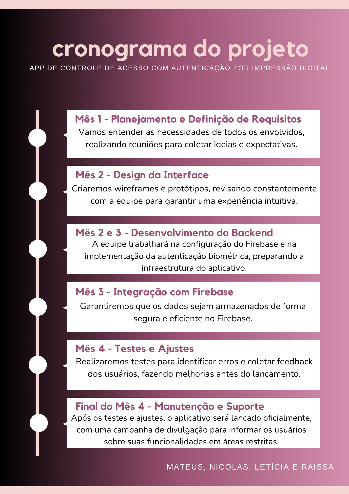
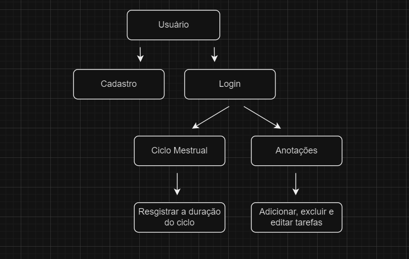
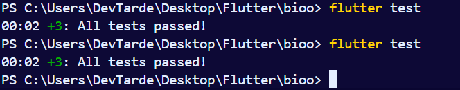

# Flowers

## Descrição do Projeto
Nosso aplicativo oferece um controle de acesso seguro para áreas restritas utilizando autenticação biométrica por impressão digital, com validação em uma localização específica para maior segurança. Após a autenticação, os usuários podem visualizar o calendário menstrual, registrar dados do ciclo, ou acessar anotações pessoais. O banco de dados armazena registros de acessos com data, hora e localização, além de informações do ciclo menstrual e anotações.

---

## Objetivos SMART
1. **Específico:** Criar um app com controle de acesso por impressão digital, ferramenta de gestão do ciclo menstrual e anotações pessoais.
2. **Mensurável:** Alcançar 90% de precisão na autenticação e 80% de sucesso nos registros de ciclo e anotações.
3. **Atingível:** Implementar funcionalidades principais com a equipe atual e realizar testes com usuários.
4. **Relevante:** Proteger áreas corporativas e fornecer uma ferramenta útil para gestão de saúde e anotações.
5. **Temporal:** Concluir o desenvolvimento em 4 meses, com uma fase de testes beta de 2 semanas.

---

## Funcionalidades Implementadas e Decisões de Design

### 1. Autenticação Biométrica e Validação Geográfica
- **Descrição:** A autenticação biométrica é validada apenas em localizações específicas, limitando o acesso a áreas restritas. 
- **Decisões de Design:** Tela de autenticação minimalista, com destaque nos botões de "Cadastro" e "Login" e validação da localização no momento do login.

### 2. Gestão do Ciclo Menstrual e Calendário
- **Descrição:** Ferramenta de calendário para registro do ciclo menstrual, com opção de registrar a duração e dias específicos.
- **Decisões de Design:** Interface interativa com ícones representativos para facilitar a navegação e visualização dos registros.

### 3. Lista de Tarefas e Anotações
- **Descrição:** Página dedicada à gestão de tarefas e anotações pessoais. Opções para editar, excluir e marcar como concluídas.
- **Decisões de Design:** Interface intuitiva com campos para adicionar tarefas e ícones para edição e exclusão, facilitando o uso.

---

## Uso de APIs Externas e Integração com Firebase

### Firebase
- **Autenticação:** Gerencia cadastro e login dos usuários com autenticação segura.
- **Banco de Dados:** Firebase Firestore armazena registros de acessos, ciclo menstrual e tarefas/anotações.

### APIs de Geolocalização
- **Uso:** Valida a localização do usuário no momento do login, garantindo o acesso somente em áreas específicas.
- **Decisões de Design:** Realiza a validação em tempo real para reforçar a segurança do acesso.

### Local Auth
- **Autenticação:** Garante a segurança do usuário por meio de uma verificação biometrica.
  
---

## Desafios e Soluções

### 1. Precisão da Validação Biométrica
- **Desafio:** A precisão variava em diferentes dispositivos.
- **Solução:** Sessão de treinamento para o usuário e integração de uma biblioteca de autenticação biométrica compatível com uma ampla gama de dispositivos Android e iOS.

### 2. Segurança dos Dados no Firebase
- **Desafio:** Proteção dos dados sensíveis armazenados.
- **Solução:** Regras de segurança do Firebase para restrição de acesso, criptografia de dados em trânsito e auditorias semanais para monitorar atividades.

### 3. Sincronização da Localização para Acesso Controlado
- **Desafio:** Geolocalização imprecisa em áreas com sinal fraco.
- **Solução:** Verificações periódicas de localização para melhorar a precisão e a opção de redefinir a localização preferida.

---

## Passo a Passo para Rodar o Aplicativo Localmente

1. Instale o VSCode, Flutter e faça as configurações necessárias.
2. Conecte seu dispositivo móvel ao computador via cabo USB.
3. No VSCode, selecione o dispositivo conectado.
4. No terminal, execute `flutter run` para iniciar o aplicativo.

---

### Manual do Usuário

### Página Inicial
Ao abrir o aplicativo, você será levado à Página Inicial, onde pode:

Criar uma nova conta usando a opção de Cadastro.
Fazer login em uma conta existente para acessar as funcionalidades.
Controle de Acesso
Cadastro
Para criar uma conta:

Na página inicial, selecione Cadastro.
Insira os dados solicitados, como nome, email e senha.
Confirme a criação da conta e você será redirecionado para a Página Inicial.
Login
Para fazer login:

Na página inicial, selecione Login.
Insira seu email e senha cadastrados.
Após a autenticação, você será redirecionado para a página principal com acesso às funcionalidades do aplicativo.
Navbar
A Navbar é o menu de navegação que permite acesso rápido às funcionalidades principais:

Lista de Tarefas: Adicione, edite e exclua tarefas.
Calendário do Ciclo Menstrual: Registre e acompanhe seu ciclo menstrual.
Funcionalidades
Lista de Tarefas
A Lista de Tarefas permite que você gerencie suas atividades diárias com facilidade.

### Adicionar Tarefa:

Clique em "Adicionar Tarefa".
Insira o título, descrição e prazo da tarefa.
Confirme para salvar a tarefa na lista.
Editar Tarefa:

Na lista de tarefas, selecione a tarefa que deseja editar.
Atualize as informações conforme necessário.
Salve as alterações.
Excluir Tarefa:

Na lista de tarefas, localize a tarefa que deseja remover.
Clique em "Excluir" para removê-la permanentemente.
Calendário do Ciclo Menstrual
No Calendário do Ciclo Menstrual, você pode registrar o início e a duração do ciclo, permitindo um acompanhamento mais detalhado de sua saúde.

### Registrar Ciclo:

Clique em "Registrar Ciclo".
Insira a data de início e a duração do ciclo.
Salve as informações para visualizá-las no calendário.
Histórico do Ciclo:

Acompanhe o histórico de ciclos anteriores, acessando o calendário e revisando dados registrados.

---

### Cronograma

### Diagrama de Classe

### Diagrama de Fluxo

### Diagrama de Uso

### Prototipagem de Alta fidelidade

### Testes Unitários

